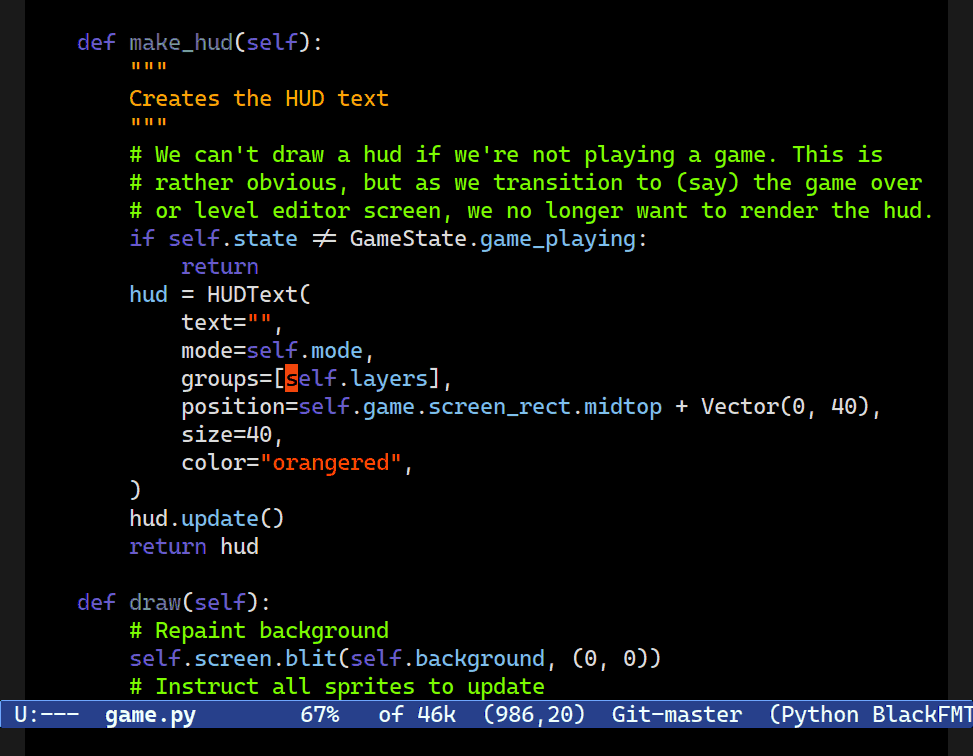
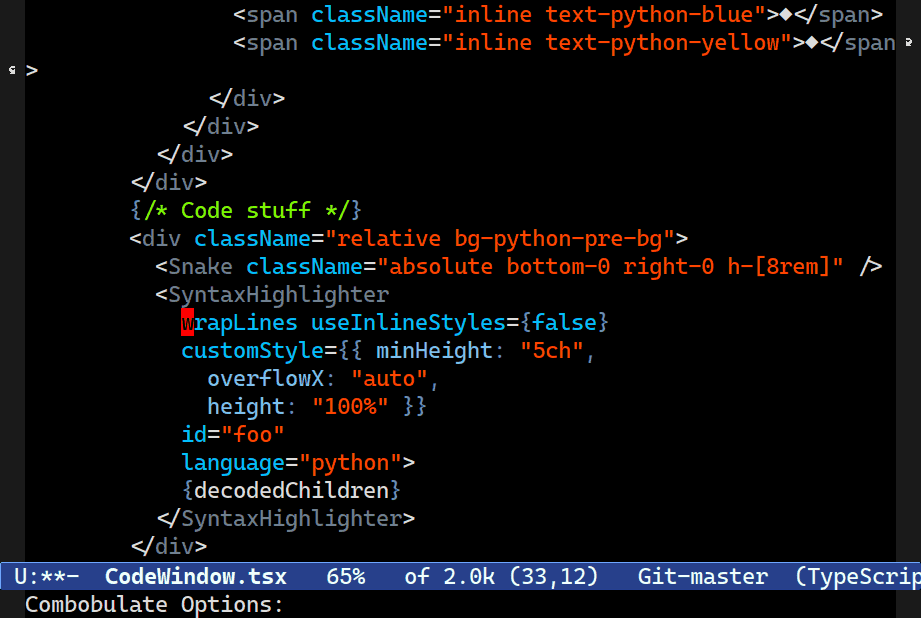
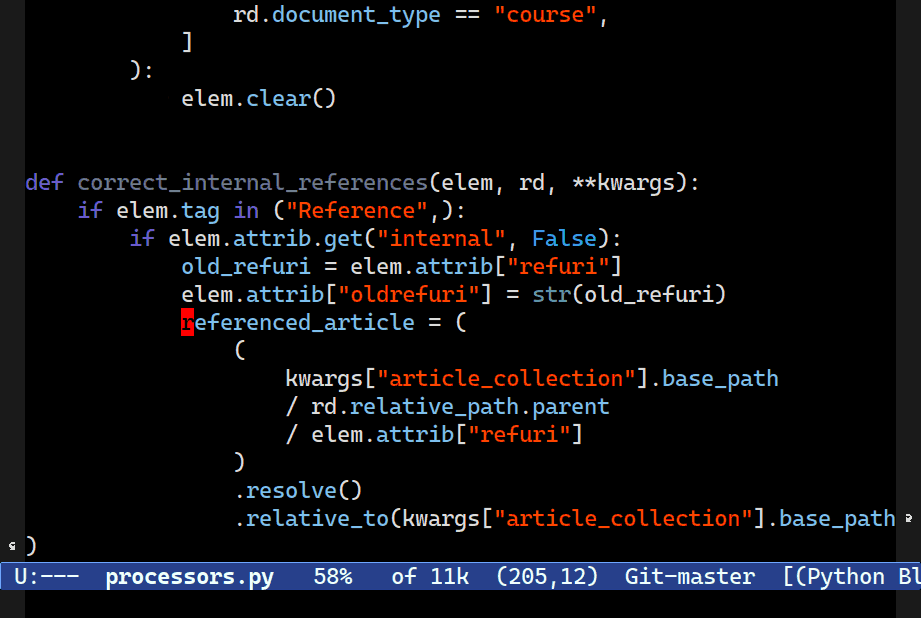

====================================================
 Structured Navigation and Editing with Combobulate
====================================================

What is Combobulate?
====================

**Combobulate is under active development. Expect bugs.**

Combobulate is a package that adds structured editing and movement to a wide range of programming languages. Unlike most programming major modes that use error-prone imperative code and regular expressions to determine what's what in your code, Combobulate uses Emacs 29's tree-sitter library. Tree-sitter maintains a *concrete syntax tree* of your code; it gives Combobulate absolute clarity of all aspects of your code, enabling more correct movement and editing than you would otherwise have.

.. image:: docs/combobulate.png

Combobulate extends the existing editing and navigation capabilities of Emacs in addition to adding a range of new features you can't easily do in Emacs without Combobulate.

Combobulate's design philosophy is this:

1. It must be extensible and *relatively* easy to add new languages.

   Open ``combobulate-<lang>.el`` to see how each mode is defined.

2. Commands should broadly work the same across all languages.

3. A strong emphasis on extending and enriching the existing movement and editing commands where possible.

4. Combobulate must have a shallow learning curve.

If you want a guided tour, then I recommend you read:

- `Combobulate: Structured Movement and Editing with Tree-Sitter <https://www.masteringemacs.org/article/combobulate-structured-movement-editing-treesitter>`__, for an in-depth overview of Combobulate.
- `Combobulate: Editing and Searching with the new Query Builder <https://www.masteringemacs.org/article/combobulate-editing-searching-new-query-builder>`__, demonstrating how Combobulate's query builder and search works.
- `Combobulate: Intuitive, Structured Navigation with Tree-Sitter <https://www.masteringemacs.org/article/combobulate-intuitive-structured-navigation-treesitter>`__, which talks about why it's so hard to write navigation code that works the way you expect it to.

What does Combobulate do exactly?
---------------------------------

Combobulate is as a companion to the existing movement and editing facilities in Emacs. It's designed to sympathetically improve or supplant editing and movement in many major modes that are otherwise lacking or incorrect. If you're familiar with Emacs's many movement and editing commands, then Combobulate will feel right at home.

There's a large emphasis on Combobulate being both easy to use, and a natural extension to Emacs's already-powerful editing and movement commands.

.. image:: docs/sibling-nav-jsx.gif

For instance, navigating up or down list structures with ``C-M-u`` and ``C-M-d`` is much improved. Whether you're navigating in or out of structures in Python or JSX elements in Typescript or Javascript.

Combobulate also improves list-like navigation bound to ``C-M-n`` and ``C-M-p``, as shown above also. They now understand hierarchical code much better, and they will navigate between statements in code as well as parameters in functions or key pairs in dictionaries.

.. image:: docs/drag-complex.gif

Combobulate also adds a wide range of code editing commands, such as the ability to drag logical pieces of code up or down regardless of the size or complexity of the code. If you can navigate between elements with ``C-M-<p/n>``, then you can drag them around with ``M-P`` and ``M-N``.

Much like the popular expand regions package, Combobulate can also expand the region one syntactically interesting unit at time: first the string point is in, then the list that is in, and so on.

Combobulate can also place cursors (using the optional *multiple cursors* package) at syntactically important points in your code, like: dictionary elements; function arguments; or attributes in JSX elements.

.. image:: docs/clone-dwim.gif

You can clone code with ease. If Combobulate cannot guess the exact thing you want to clone, you'll be asked to interactively preview and pick the right node to clone.

Combobulate can *splice* your code. Any code. For instance, you can keep some of your HTML tags and splice them into the parent node, removing it in the process.

and much more!

Getting Started with Combobulate
--------------------------------

Combobulate has to support your programming language for it to work properly. More importantly, it should ideally be the right **Grammar version** as the table below explains. If you use a newer, or older, version you may run into issues --- not just in Combobulate, but Emacs also!

Here is a list of the languages currently supported.

+--------------------+--------------------+--------------------+
|          Language  |Supported?          | Grammar Version    |
+--------------------+--------------------+--------------------+
|CSS                 |✅                  |v0.20.0             |
+--------------------+--------------------+--------------------+
|HTML                |✅ [1]              |v0.20.1             |
+--------------------+--------------------+--------------------+
|JSON                |✅                  |v0.20.2             |
+--------------------+--------------------+--------------------+
|Javascript+JSX      |✅                  |v0.20.1             |
+--------------------+--------------------+--------------------+
|Typescript+TSX      |✅                  |v0.20.3             |
+--------------------+--------------------+--------------------+
|Python              |✅                  |v0.20.4             |
+--------------------+--------------------+--------------------+
|YAML                |✅                  |v0.5.0              |
+--------------------+--------------------+--------------------+
|TOML                |✅                  |v0.5.1              |
+--------------------+--------------------+--------------------+

*Don't see your language? If you want your favourite language added, then why not try it yourself? Have a look at ``combobulate-json.el`` for an example.*

When you have installed Combobulate correctly -- see below -- then it'll turn on when you open a file in one of its supported major modes. If it does not do this, try ``M-x combobulate-mode`` to activate Combobulate's minor mode.

If it's working, you'll see a ``©`` appear in your mode line.

At that point, Combobulate is now working. Combobulate rebinds a wide range of common navigation and editing keys. You can see a complete list by typing ``M-x describe-keymap RET combobulate-key-map``.

*Note that Combobulate may enable or disable keys depending on the major mode it is active in.*

Furthermore, Combobulate ships with a Magit-like transient UI that you can access by typing ``C-c o o``. It exists primarily to teach you about Combobulate's capabilities: every key binding in it is also available without the popup.

 [1] Either use the version built into *Emacs 30*, or you can download my ``html-ts-mode`` `here <https://github.com/mickeynp/html-ts-mode>`__, and read more about how to build your own tree-sitter major mode by reading `Let's Write a Tree-Sitter Major Mode <https://www.masteringemacs.org/article/lets-write-a-treesitter-major-mode>`__.

Top Tips for using Combobulate
~~~~~~~~~~~~~~~~~~~~~~~~~~~~~~

Unlike most of Emacs's major modes and the specialized movement and editing they (may) offer, Combobulate is quite strict. It's strict about *where* you invoke certain commands or key bindings, and what happens when you type in different parts of the same line of code.

That is because of the *concrete syntax tree*. Place your point anywhere in your source code and there might be 5, 10, 15 or more "nodes" in the tree where that point intersects wildly different nodes.

For example: your point is on a string; but it's also in a list; which is in a dictionary; which is in an expression statement; which is in a ``for``-loop; which is in a function, and so on.

Because a *concrete syntax tree* is so exacting and so detailed, it's hard for Combobulate to infer what you want to do with the same casual insouciance of commands that don't use a syntax tree: there are simply too many choices, and too many nodes.

You, the human, know which node you want -- but Combobulate does not necessarily know that!

So, for the best results, put your point at the *beginning* of the thing you want to interact with --- at least until you've gotten the hang of how Combobulate decides what it thinks you're asking for.

Finally, note that any command that edits your code is at best a "best guess" effort. Carefully scrutinize what Combobulate does after you invoke any command that edits your code.

How do I install Combobulate?
-----------------------------

**NOTE: The tree-sitter grammars can and do change. If that happens, it can cause issues in Emacs or Combobulate. If you see strange query validation errors or broken highlighting, try using an older grammar checkout from Git. See the table above or the example code below.**

Combobulate is not on MELPA or any other package repository, yet. For Combobulate to install properly you must meet the following requirements:

1. You must be running Emacs 29 or later.
2. Your Emacs *must* be compiled with tree-sitter support. Read `How to Get Started with Tree Sitter <https://www.masteringemacs.org/article/how-to-get-started-tree-sitter>`__ to learn how to compile Emacs and install tree-sitter.

   In ``C-h v system-configuration-features`` look for ``TREE_SITTER``.
3. You must have language grammars installed for the languages you want to use Combobulate with.

   **However**, you can optionally ask Emacs to download, compile and install these language grammars, but you'll need a suitable C compiler. If you're using Linux, then no problem. Non-Linux users may need to install or configure their operating system to do this.

4. You're interested in using Combobulate with one of the supported languages you saw in the table above.

   (Adding support for new languages is reasonably easy though!)
5. You have a git checkout of Combobulate ready.

There are two code snippets below that will help you get started. One assumes you don't know how to install and set up tree-sitter grammars, whereas the other one does.

Complete Example with Tree-Sitter Grammar Installation
~~~~~~~~~~~~~~~~~~~~~~~~~~~~~~~~~~~~~~~~~~~~~~~~~~~~~~

*This is a complete example and is for illustration only.*

Note that this example uses ``major-mode-remap-alist`` to turn your regular major modes into the tree-sitter-enabled modes. You can always undo the changes made to this variable to return to what you had before.

.. code-block:: elisp

    ;; `M-x combobulate' (default: `C-c o o') to start using Combobulate
    (use-package treesit
      :mode (("\\.tsx\\'" . tsx-ts-mode))
      :preface
      (defun mp-setup-install-grammars ()
        "Install Tree-sitter grammars if they are absent."
        (interactive)
        (dolist (grammar
                  '((css . ("https://github.com/tree-sitter/tree-sitter-css" "v0.20.0"))
                    (html . ("https://github.com/tree-sitter/tree-sitter-html" "v0.20.1"))
                    (javascript . ("https://github.com/tree-sitter/tree-sitter-javascript" "v0.20.1" "src"))
                    (json . ("https://github.com/tree-sitter/tree-sitter-json" "v0.20.2"))
                    (python . ("https://github.com/tree-sitter/tree-sitter-python" "v0.20.4"))
                    (toml . ("https://github.com/tree-sitter/tree-sitter-toml" "v0.5.1"))
                    (tsx . ("https://github.com/tree-sitter/tree-sitter-typescript" "v0.20.3" "tsx/src"))
                    (typescript . ("https://github.com/tree-sitter/tree-sitter-typescript" "v0.20.3" "typescript/src"))
                    (yaml . ("https://github.com/ikatyang/tree-sitter-yaml" "v0.5.0"))))
          (add-to-list 'treesit-language-source-alist grammar)
          ;; Only install `grammar' if we don't already have it
          ;; installed. However, if you want to *update* a grammar then
          ;; this obviously prevents that from happening.
          (unless (treesit-language-available-p (car grammar))
            (treesit-install-language-grammar (car grammar)))))

      ;; Optional, but recommended. Tree-sitter enabled major modes are
      ;; distinct from their ordinary counterparts.
      ;;
      ;; You can remap major modes with `major-mode-remap-alist'. Note
      ;; that this does *not* extend to hooks! Make sure you migrate them
      ;; also
      (dolist (mapping
             '((python-mode . python-ts-mode)
               (css-mode . css-ts-mode)
               (typescript-mode . typescript-ts-mode)
               (js2-mode . js-ts-mode)
               (bash-mode . bash-ts-mode)
               (conf-toml-mode . toml-ts-mode)
               (css-mode . css-ts-mode)
               (json-mode . json-ts-mode)
               (js-json-mode . json-ts-mode)))
        (add-to-list 'major-mode-remap-alist mapping))
      :config
      (mp-setup-install-grammars)
      ;; Do not forget to customize Combobulate to your liking:
      ;;
      ;;  M-x customize-group RET combobulate RET
      ;;
      (use-package combobulate
        :preface
        ;; You can customize Combobulate's key prefix here.
        ;; Note that you may have to restart Emacs for this to take effect!
        (setq combobulate-key-prefix "C-c o")

        ;; Optional, but recommended.
        ;;
        ;; You can manually enable Combobulate with `M-x
        ;; combobulate-mode'.
        :hook
          ((python-ts-mode . combobulate-mode)
           (js-ts-mode . combobulate-mode)
           (html-ts-mode . combobulate-mode)
           (css-ts-mode . combobulate-mode)
           (yaml-ts-mode . combobulate-mode)
           (toml-ts-mode . combobulate-mode)
           (typescript-ts-mode . combobulate-mode)
           (json-ts-mode . combobulate-mode)
           (tsx-ts-mode . combobulate-mode))
        ;; Amend this to the directory where you keep Combobulate's source
        ;; code.
        :load-path ("path-to-git-checkout-of-combobulate")))

Simple Combobulate Setup
~~~~~~~~~~~~~~~~~~~~~~~~

.. code-block:: elisp

    (use-package treesit
      :mode (("\\.tsx\\'" . tsx-ts-mode))
      :config
      ;; Do not forget to customize Combobulate to your liking:
      ;;
      ;;  M-x customize-group RET combobulate RET
      ;;
      (use-package combobulate
        :preface
        ;; You can customize Combobulate's key prefix here.
        ;; Note that you may have to restart Emacs for this to take effect!
        (setq combobulate-key-prefix "C-c o")
        :hook
          ((python-ts-mode . combobulate-mode)
           (js-ts-mode . combobulate-mode)
           (html-ts-mode . combobulate-mode)
           (css-ts-mode . combobulate-mode)
           (yaml-ts-mode . combobulate-mode)
           (toml-ts-mode . combobulate-mode)
           (typescript-ts-mode . combobulate-mode)
           (json-ts-mode . combobulate-mode)
           (tsx-ts-mode . combobulate-mode))
        ;; Amend this to the directory where you keep Combobulate's source
        ;; code.
        :load-path ("path-to-git-checkout-of-combobulate")))
