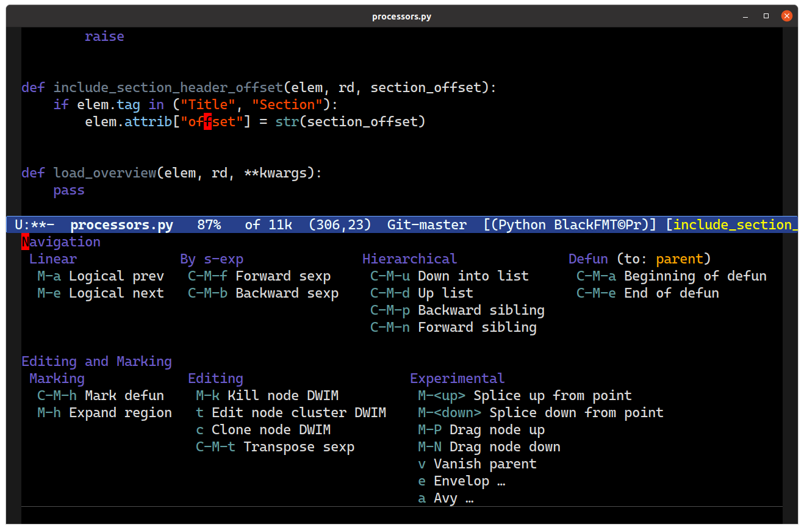
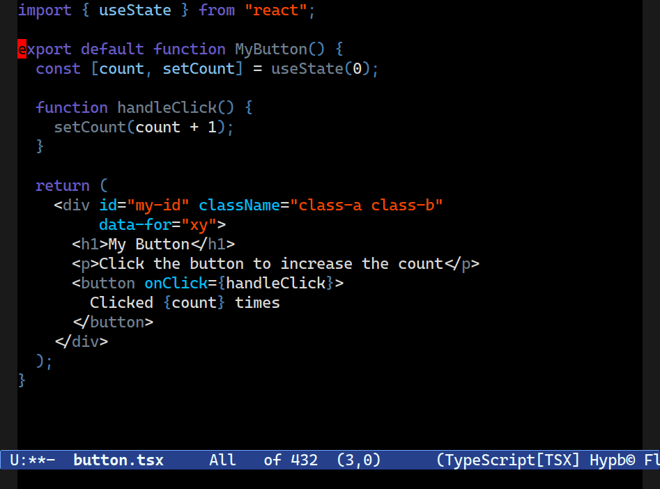
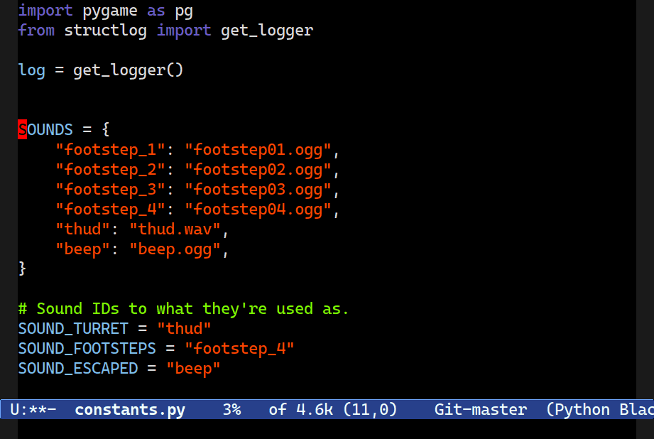
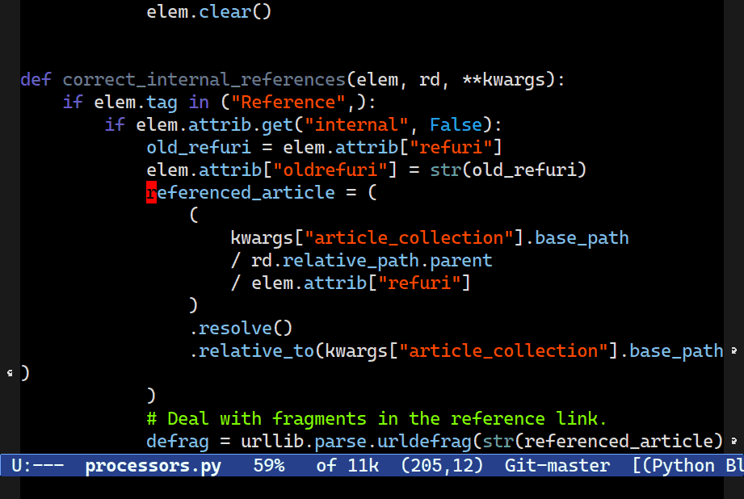

====================================================
 Structured Navigation and Editing with Combobulate
====================================================

What is Combobulate?
====================

**Combobulate is under active development. Expect bugs.**

Combobulate is a package that adds structured editing and movement to a wide range of programming languages. Unlike most programming major modes that use error-prone imperative code and regular expressions to determine what's what in your code, Combobulate uses Emacs 29's tree-sitter library. Tree-sitter maintains a *concrete syntax tree* of your code; it gives Combobulate absolute clarity of all aspects of your code, enabling more correct movement and editing than you would otherwise have.

Combobulate extends the existing editing and navigation capabilities of Emacs in addition to adding a range of new features you can't easily do in Emacs without Combobulate.

Combobulate's design philosophy is this:

1. It must be extensible and *relatively* easy to add new languages.

   Open ``combobulate-<lang>.el`` to see how each mode is defined.

2. Commands should broadly work the same across all languages.

3. A strong emphasis on extending and enriching the existing movement and editing commands where possible.

4. Combobulate must have a shallow learning curve.

If you want a guided tour, then I recommend you read `Combobulate: Structured Movement and Editing with Tree-Sitter <https://www.masteringemacs.org/article/combobulate-structured-movement-editing-treesitter>`__ for an in-depth overview.

What does Combobulate do exactly?
---------------------------------

Combobulate is meant as a companion to the existing movement and editing facilities in Emacs. It's designed to sympathetically improve or supplant editing and movement in many major modes that are otherwise lacking or incorrect. There's a large emphasis on Combobulate being both easy to use, and a natural extension to Emacs's already-powerful editing and movement commands.

For instance, navigating up or down list structures with ``C-M-u`` and ``C-M-d`` is much improved. Whether you're navigating in or out of structures in Python or JSX elements in Typescript of Javascript.

Combobulate also improves list-like navigation bound to ``C-M-n`` and ``C-M-p``. They now understand hierarchical code much better, and they will navigate between statements in code as well as parameters in functions or key pairs in dictionaries.

Combobulate also adds code editing commands, such as the ability to drag logical pieces of code up or down, if they span multiple lines. It can also expand the region one syntactically interesting unit at time: first the string point is in, then the list that is in, and so on.

Combobulate can also place cursors (using the optional *multiple cursors* package) at syntactically important points in your code, like: dictionary elements; function arguments; or attributes in JSX elements.

You can clone code and experimentally splice code, much like Paredit. Combobulate also comes with a simple code templating tool that you can use to insert or modify code, such as wrapping a code block in an ``if`` statement in Python, or a JSX element in an expression statement.

.. There is a lot more to be said about what Combobulate can do. Read this article XXXXX for a deep dive.

Getting Started with Combobulate
--------------------------------

When you have installed Combobulate correctly -- see below -- then it'll turn on when you open a file in one of its supported major modes. If it does not do this, try ``M-x combobulate-mode`` to activate Combobulate's minor mode.

If it's working, you'll see a ``©`` appear in your mode line.

At that point, Combobulate is now working. Combobulate rebinds a wide range of common navigation and editing keys. You can see a complete list by typing ``M-x describe-keymap RET combobulate-key-map``.

*Note that Combobulate may enable or disable keys depending on the major mode it is active in.*

Furthermore, Combobulate ships with a Magit-like transient UI that you can access by typing ``C-c o o``. It exists primarily to teach you about Combobulate's capabilities: every key binding in it is also available without the popup.

Top Tips for using Combobulate
~~~~~~~~~~~~~~~~~~~~~~~~~~~~~~

Unlike most of Emacs's major modes and the specialized movement and editing they (may) offer, Combobulate is quite strict. It's strict about *where* you invoke certain commands or key bindings, and what happens when you type in different parts of the same line of code.

That is because of the *concrete syntax tree*. Place your point anywhere in your source code and there might be 5, 10, 15 or more "nodes" in the tree where that point intersects wildly different nodes.

For example: your point is on a string; but it's also in a list; which is in a dictionary; which is in an expression statement; which is in a ``for``-loop; which is in a function, and so on.

Because a *concrete syntax tree* is so exacting and so detailed, it's hard for Combobulate to infer what you want to do with the same casual insouciance of commands that don't use a syntax tree: there are simply too choices, and too many nodes.

You, the human, know which node you want -- but Combobulate does not necessarily know that!

So, for best results, put your point at the *beginning* of the thing you want to interact with --- at least until you've gotten the hang of how Combobulate decides what it thinks you're asking for.

Finally, note that any command that edits your code is at best a "best guess" effort. Carefully scrutinize what Combobulate does after you invoke any command that edits.

How do I install Combobulate?
-----------------------------

Combobulate is not on MELPA or any other package repository, yet. For Combobulate to install properly you must meet the following requirements:

1. You must be running Emacs 29 or later.
2. Your Emacs *must* be compiled with tree-sitter support. Read `How to Get Started with Tree Sitter <https://www.masteringemacs.org/article/how-to-get-started-tree-sitter>`__ to learn how to compile Emacs and install tree-sitter.

   In ``C-h v system-configuration-features`` look for ``TREE_SITTER``.
3. You must have language grammars installed for the languages you want to use Combobulate with.

   **However**, you can optionally ask Emacs to download, compile and install these language grammars, but you'll need a suitable C compiler. If you're using Linux, then no problem. Non-Linux users may need to install or configure their operating system to do this.

4. You're interested in using Combobulate with one of these supported Languages:

     CSS, Typescript+TSX, Javascript, Python, or YAML.

   (Adding support for new languages is reasonably easy though!)
5. You have a git checkout of Combobulate ready.

Here's a verbose example of how to configure Combobulate in Emacs with ``use-package``. Note that if you already know how to install tree-sitter  grammars, then you can leave out the code that does this in the ``:preface``.

Also note that this example uses ``major-mode-remap-alist`` to turn your regular major modes into the tree-sitter-enabled modes.

.. code-block:: elisp

    ;; `M-x combobulate' (default: `C-c o o') to start using Combobulate
    (use-package treesit
      :preface
      (defun mp-setup-install-grammars ()
        "Install Tree-sitter grammars if they are absent."
        (interactive)
        (dolist (grammar
                 '((css "https://github.com/tree-sitter/tree-sitter-css")
                   (javascript . ("https://github.com/tree-sitter/tree-sitter-javascript" "master" "src"))
                   (python "https://github.com/tree-sitter/tree-sitter-python")
                   (tsx . ("https://github.com/tree-sitter/tree-sitter-typescript" "master" "tsx/src"))
                   (yaml "https://github.com/ikatyang/tree-sitter-yaml")))
          (add-to-list 'treesit-language-source-alist grammar)
          ;; Only install `grammar' if we don't already have it
          ;; installed. However, if you want to *update* a grammar then
          ;; this obviously prevents that from happening.
          (unless (treesit-language-available-p (car grammar))
            (treesit-install-language-grammar (car grammar)))))

      ;; Optional, but recommended. Tree-sitter enabled major modes are
      ;; distinct from their ordinary counterparts.
      ;;
      ;; You can remap major modes with `major-mode-remap-alist'. Note
      ;; that this does *not* extend to hooks! Make sure you migrate them
      ;; also
      (dolist (mapping '((python-mode . python-ts-mode)
                         (css-mode . css-ts-mode)
                         (typescript-mode . tsx-ts-mode)
                         (js-mode . js-ts-mode)
                         (css-mode . css-ts-mode)
                         (yaml-mode . yaml-ts-mode)))
        (add-to-list 'major-mode-remap-alist mapping))

      :config
      (mp-setup-install-grammars)
      ;; Do not forget to customize Combobulate to your liking:
      ;;
      ;;  M-x customize-group RET combobulate RET
      ;;
      (use-package combobulate
        :preface
        ;; You can customize Combobulate's key prefix here.
        ;; Note that you may have to restart Emacs for this to take effect!
        (setq combobulate-key-prefix "C-c o")
        
        ;; Optional, but recommended.
        ;;
        ;; You can manually enable Combobulate with `M-x
        ;; combobulate-mode'.
        :hook ((python-ts-mode . combobulate-mode)
               (js-ts-mode . combobulate-mode)
               (css-ts-mode . combobulate-mode)
               (yaml-ts-mode . combobulate-mode)
               (typescript-ts-mode . combobulate-mode)
               (tsx-ts-mode . combobulate-mode))
        ;; Amend this to the directory where you keep Combobulate's source
        ;; code.
        :load-path ("path-to-git-checkout-of-combobulate")))
