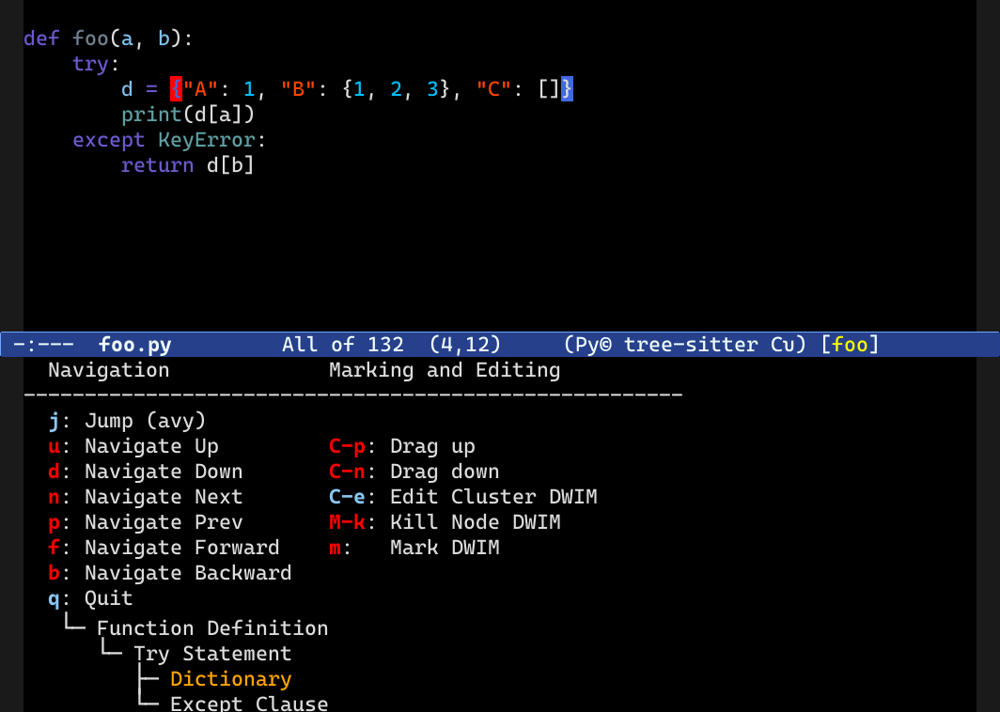
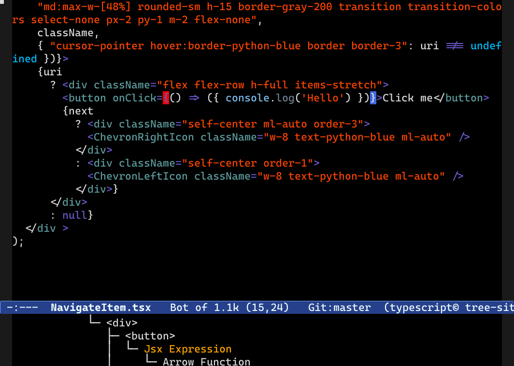
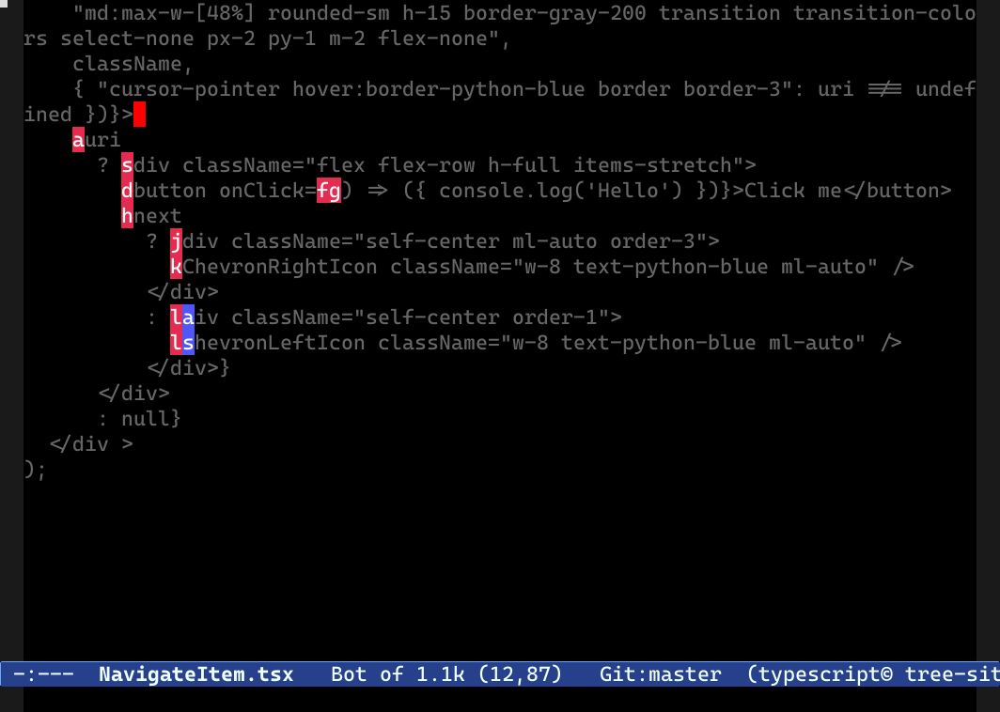

====================================================
 Structured Navigation and Editing with Combobulate
====================================================

What is Combobulate?
====================

.. note:: Combobulate is **alpha software** with all the caveats that follows from that. Your author uses it daily however, though breaking changes are likely.

Combobulate is an Emacs package that provides a standardized framework for manipulating and navigating your source code using tree sitter's concrete syntax tree. Combobulate is language agnostic and should work with little modification almost all languages supported by tree sitter itself.

Benefits
--------

Combobulate is new and it does not have as many features yet as it's likely to get over time. It is designed to help you navigate and edit your code faster than the tools offered by your major mode (or some Language Server features).

To start with, Combobulate improves navigation like letting you navigate in or out of syntactic structures that your language may use. In some that might be functions, try/except, while/for blocks and classes like in Python; in others, it might be React-style JSX and Javascript or Typescript. Because Combobulate has a perfect understanding of your code it's able to faultlessly navigate to things most other major modes would struggle with, like arrow functions in Javascript.

Combobulate also co-operates with third-party packages you may already use: Combobulate can activate multiple cursors and place them on every dictionary, list, or tuple element in Python, or against every attribute in JSX. Extending this to other parts of a language is easy.

Because it offers a unified framework for all programming languages, Combobulate is designed to be easy to extend or modify. Open ``combobulate-<language>.el`` to see the language-specific features it offers. The Python example is a good place to start.

You can use Avy to quick jump to important parts of you code, like function definitions. You can also drag elements up or down to re-arrange them.

In addition to this, Combobulate ships with a basic hierarchical aid that shows you where you're navigating if you use its navigation features.

Philosophy
----------

Your author feels that Emacs comes with excellent tools for navigating and editing code as it is. Combobulate is philosophically aligned with Emacs's idea that editing and moving by "balanced expressions" (``mark-sexp``, ``forward-sexp``, ``kill-sexp``, ``up/downward-list``, etc.) is a useful way to think of text.

Before the advent of tree sitter doing so was hard in languages that did not lend themselves to this easily like LISP does. Combobulate aims to take that germ of an idea and the ideas of `ParEdit <https://www.emacswiki.org/emacs/ParEdit>`__ and make it work as consistently and transparently across languages as possible.

How do I install Combobulate?
=============================
To start using it, install this package::

  (use-package combobulate
    ;; Ensure `combobulate-mode` is activated when you launch a mode it supports
    :hook ((python-mode . combobulate-mode)
           (js-mode . combobulate-mode)
           (typescript-mode . combobulate-mode))
    :load-path "path-to-this-package")

**NOTE**: Because combobulate is alpha software it has hard dependencies on ``avy``, ``multiple-cursors`` and ``hydra``. This will change over time as the package matures. If you wish to help fix that, please submit PRs.

How do I use it?
================

To start, you can type ``C-c o o`` to open the Hydra menu (or ``M-x combobulate-menu/body``) with a selection of the commands available to you. I recommend you review the key bindings in ``combobulate-mode`` also.

By default Combobulate also binds to the following keys in its minor mode:

``C-M-u`` and ``C-M-d`` intelligent navigation in and out of parentheses (as it normally does) but it also stops at useful navigable nodes
``C-M-n`` and ``C-M-p`` moves to/from navigable siblings.

``M-k`` kills the navigable node point is in. You can use this to collectively kill larger and larger blocks of code.
``M-h`` marks the navigable node point is on. Like the kill function (or the *expand region* package) it grows the mark and point with each repeated invocation.

``C-c o j`` activates avy and lets you jump to navigable parts of your code.
``C-c o o`` opens the Hydra menu
``C-c o t`` is a prefix map of mode-specific transformations. Currently only used in Javascript and Typescript modes to vanish/wrap JSX elements.

Languages Supported
===================

The following languages are supported out of the box by Combobulate:

- Python
- Typescript + React
- Javascript + React
- HTML

*but*, it's super easy to add support for new languages. Open ``combobulate-python.el`` for an example of how to do it.

